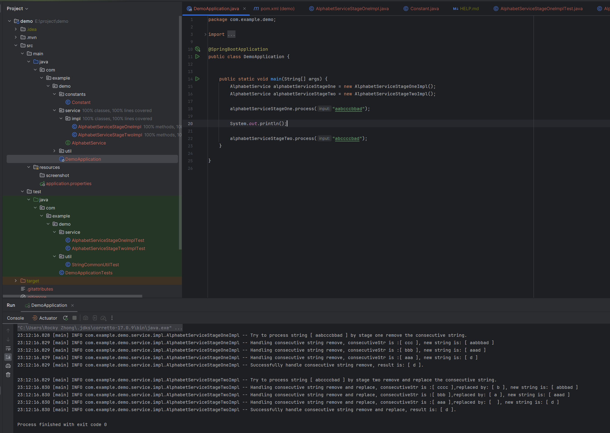
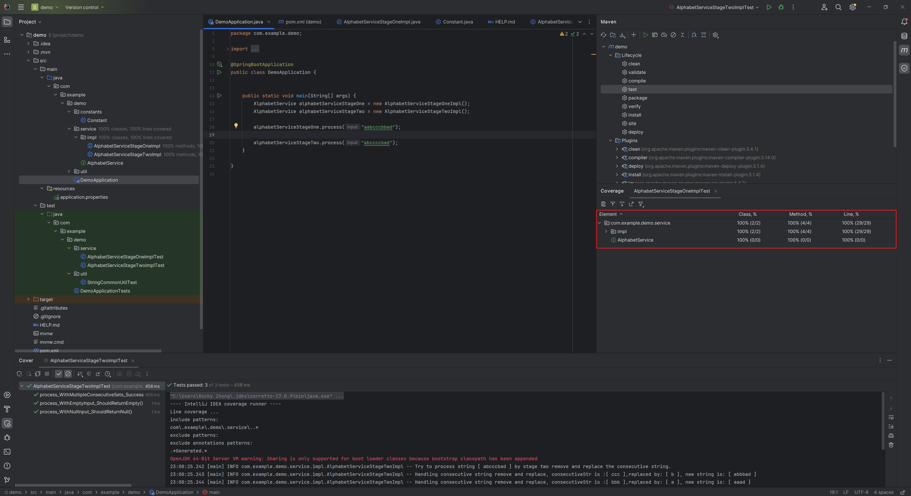

# String Demo

### Requirement

Stage 1 - basic requirement
For a given string that only contains alphabet characters a-z, if 3 or more consecutive
characters are identical, remove them from the string. Repeat this process until
there is no more than 3 identical characters sitting besides each other.

Stage 2 - advanced requirement
Instead of removing the consecutively identical characters, replace them with a
single character that comes before it alphabetically.

### Test result

### Test coverage

